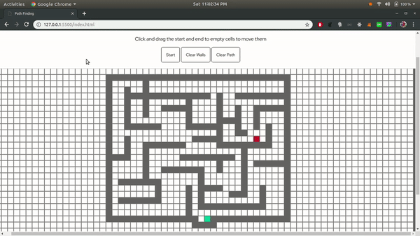

# Breadth First Search Visualization
A visualization of the Breadth First Algorithm in a grid to find the shortest path between the start and end nodes.

How to use: 
  - Click and drag the mouse over empty cells to create walls
  - Click and drag the start and end to empty cells to move them
  - Click "Start"
  - Enjoy watching how Breadth First Alogrithm finds the shortest path 
  
Test the project live at https://rex1911.github.io/breadth-first-search-visualization/
  
# Demo GIF: 

PS - The thing looks like its working slow in the GIF cause the video capturing took most of my CPU power
